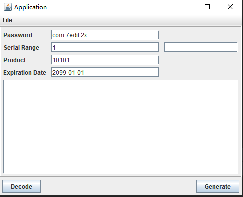

7edit序列号注册工具

 

## 功能速览

* 输入模式

  > 框中输入序列号截止日期yyyy-MM-dd，点击Generate，即可

## 环境说明

* Java
  > java1.8+

## 页面展示

## 使用说明

> 此项目为7edit工具的序列号注册器！
>
> 如果此项目有帮到您，麻烦您点下star，万分感谢！！

方式一：
> 直接运行util.licapi.gui包下的**LicenseGenerator2**类main方法即可

方式二：
> 找到 *util.licapi.io.LicenseWriter* ，此工具类中有生成的main方法

## 感谢

